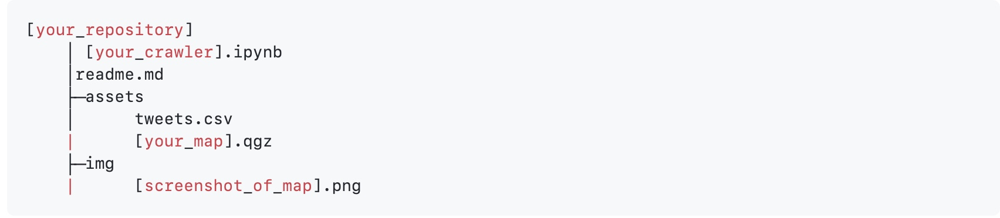
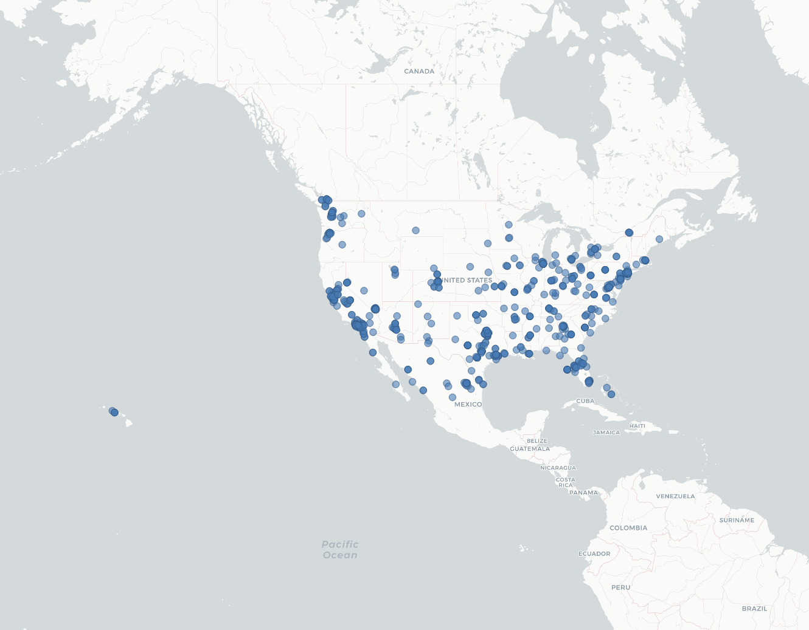

# GEOG 458 Lab 2

## Leo Kwo

This is the repository for GEOG 458 lab 2.

Here's the file structure of this repo:

## Exported Map
Here's the map generated using the data collected from the Twitter API:

**Parameters used:**
- Geotag bounded to the USA (Continental US, Alaska, and Hawaii)
- Keyword: Joe Biden
- Crawler Runtime: 120 seconds

This map shows all the tweets collected by the crawler that are geotagged to the US soil and contain keyword "joe biden". Due to the limited sample size, we can only observe vaguely two trends here:
- There is a concentration of tweets sent from densely populated areas.
  - We can see a lot of tweets sent from the Seattle Metro Area, the Los Angeles Metro Area, the New York City Metro Area, etc. If we assume the percentage of Twitter users in the population does not vary much by location, we should then expect to see more twitter users in densely populated areas and hence more tweets.
- There are tweets sent from the coastal areas than from inland areas.
  - This trend may be the result of the fact that more densely populated areas are located near the US coast lines or that most of the supporters of Joe Biden live in the coastal areas of the US rather than the inland areas.
